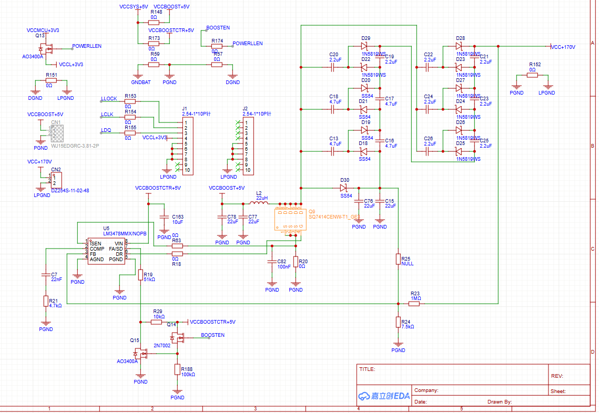
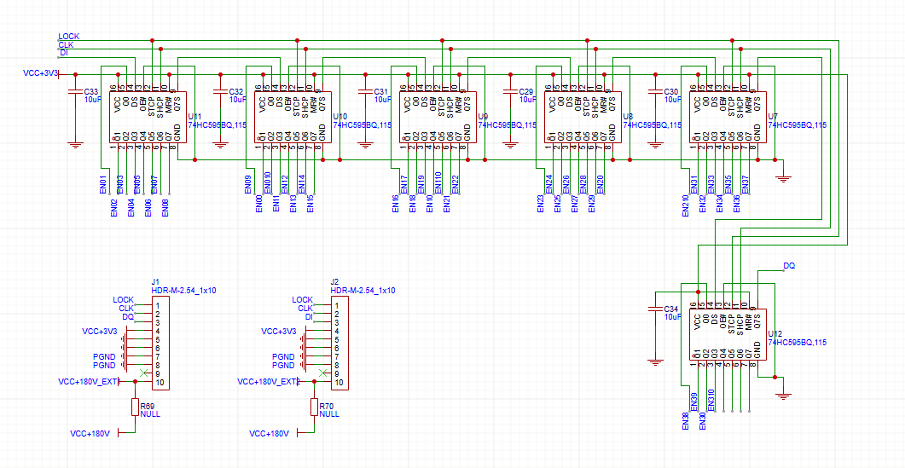
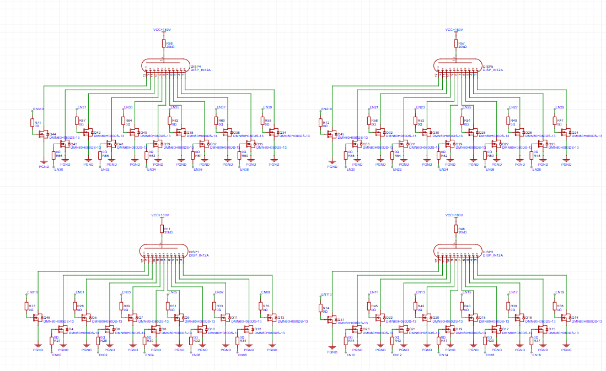
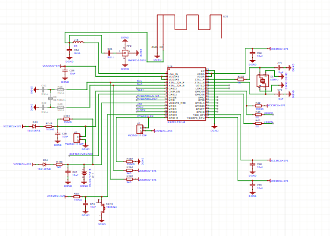
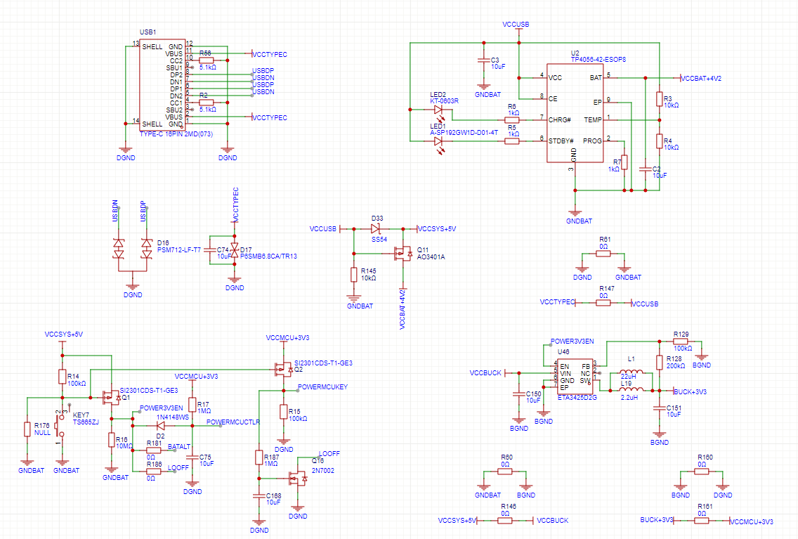
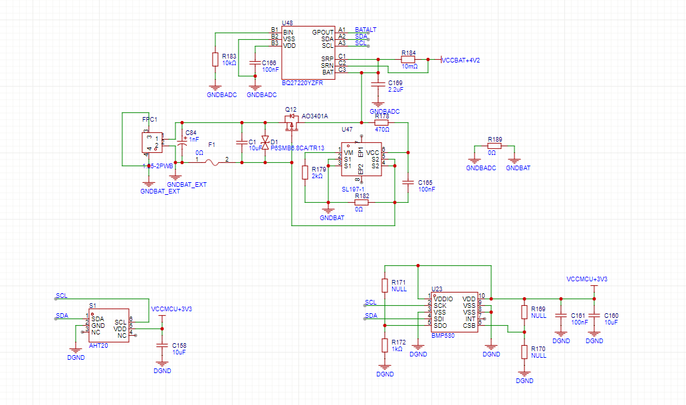
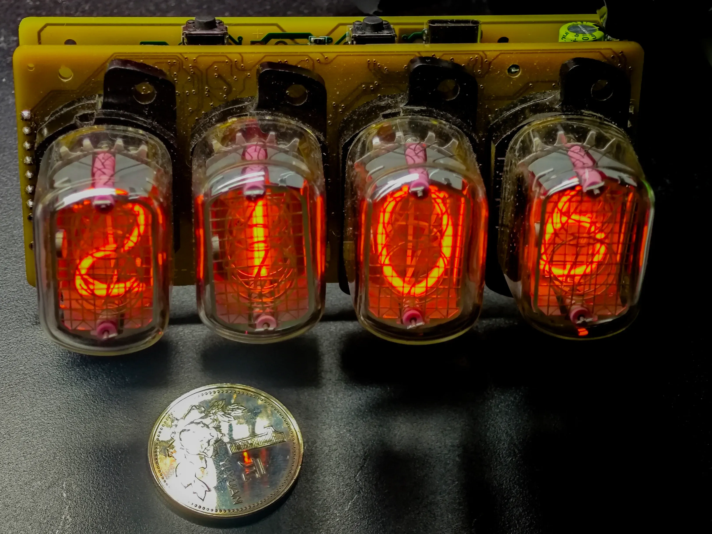
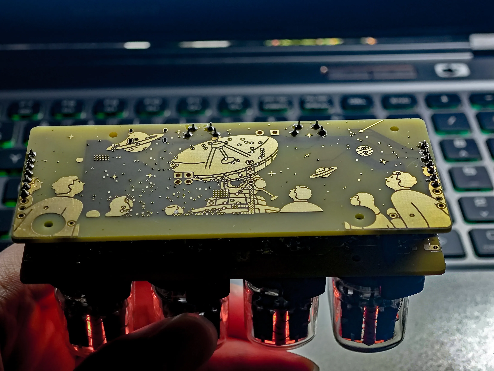

## 项目简介
本项目是基于IN12的网络辉光管设计,电路及原理采用立创eda绘制，软件用ESPIDF开发的

## 项目功能
本设计采用ESP32C3作为主控，附带温湿度计（🕊）、气压计，可以方便的通过AP或配置的wifi网络连接内置web页面进行配置；四位辉光管可以显示时间、温度、湿度、气压或其他指定的数值内容。
另外，外置两个按钮。可以通过长按按钮开关机，双击切换是否开启显示。鉴于辉光管驱动耗电较高，电池使用时间不长，建议长期使用电源供电。

目前主要的功能已经基本实现，后续电路和软件依然会修改。

## 原理解析
电路主要分为三个部分  
1、升压电路  

2、辉光管驱动  
①移位寄存器  
  
②辉光管驱动  
  

3、MCU、传感器以及附带电源  
①ESP32C3FH4  
  
②MCU电源  
  
③外设和传感器  
  

## 实物图
正面
  
背面
  
